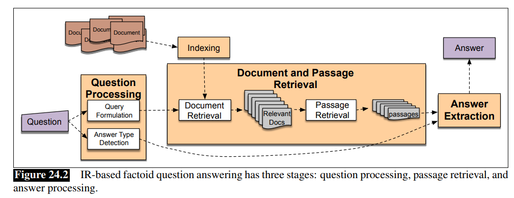

# Vietnamese Question Answering base on IR
# Requirements
 - Window or Unix/Linux environment
 - Python 2.7
 - nltk

 - sklearn
 - googleapiclient : pip install --upgrade google-api-python-client
 - BeautifulSoup
 - plotly
 - underthesea
 - nltk
 
# Originial Architecture
 - Question Answering based IR - Speech and language processing (daniel jurafsky)
 - https://web.stanford.edu/~jurafsky/slp3/24.pdf
 

